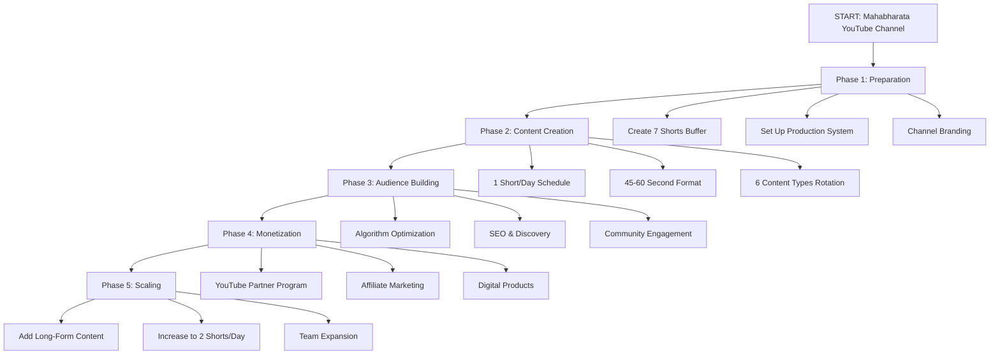
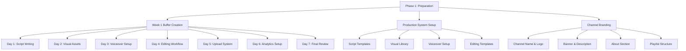
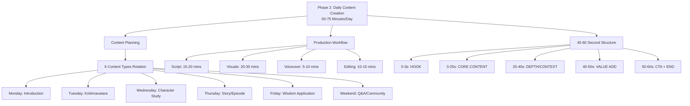
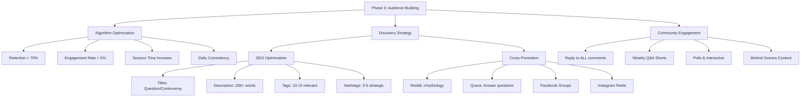
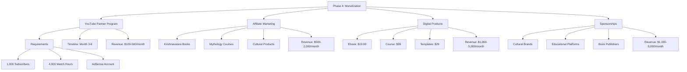
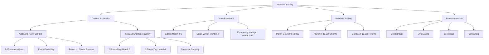

# 🎬 MAHABHARATA YOUTUBE CHANNEL - COMPLETE FLOWCHART SYSTEM

## 📊 **MASTER FLOWCHART**



## 🎯 **PHASE 1: PREPARATION FLOWCHART**



## 🎬 **PHASE 2: CONTENT CREATION FLOWCHART**



## 📈 **PHASE 3: AUDIENCE BUILDING FLOWCHART**



## 💰 **PHASE 4: MONETIZATION FLOWCHART**



## 🚀 **PHASE 5: SCALING FLOWCHART**



## 📅 **WEEKLY CONTENT CALENDAR DIAGRAM**

```
┌─────────────────────────────────────────────────────────────┐
│                    WEEKLY CONTENT CALENDAR                   │
├──────────┬──────────┬──────────┬──────────┬──────────┬──────┤
│   MON    │   TUE    │   WED    │   THU    │   FRI    │ WEEK │
│          │          │          │          │          │ END  │
├──────────┼──────────┼──────────┼──────────┼──────────┼──────┤
│          │          │          │          │          │      │
│ INTRO    │ KRISHNA- │ CHARACTER│ STORY    │ WISDOM   │ Q&A  │
│ Mahabha- │ VATARA   │ STUDY    │ EPISODE  │ APPLICA- │ Com- │
│ rata     │ Book     │ Krishna  │ Dice     │ TION     │ munity│
│ Basics   │ Focus    │ Arjuna   │ Game     │ Modern   │ Enga-│
│          │          │ Draupadi │          │ Life     │ gement│
│          │          │          │          │          │      │
│ 6 PM     │ 6 PM     │ 6 PM     │ 6 PM     │ 6 PM     │ 6 PM │
│ Post     │ Post     │ Post     │ Post     │ Post     │ Post │
│          │          │          │          │          │      │
│ Engage   │ Engage   │ Engage   │ Engage   │ Engage   │ Engage│
│ Comments │ Comments │ Comments │ Comments │ Comments │ Comments│
└──────────┴──────────┴──────────┴──────────┴──────────┴──────┘
```

## ⏰ **DAILY WORKFLOW DIAGRAM**

```
┌─────────────────────────────────────────────────────────────┐
│                    DAILY WORKFLOW (50-75 mins)               │
├───────────────────┬─────────────────────────────────────────┤
│     TIME          │              ACTIVITY                    │
├───────────────────┼─────────────────────────────────────────┤
│ 0-15 mins         │ SCRIPT WRITING                          │
│                   │ • Choose topic from calendar             │
│                   │ • Use template                           │
│                   │ • 45-60 second structure                 │
│                   │ • Hook + Content + Value + CTA           │
├───────────────────┼─────────────────────────────────────────┤
│ 15-45 mins        │ VISUAL CREATION                         │
│                   │ • Stock images/videos                    │
│                   │ • Text overlays                          │
│                   │ • Simple animations                      │
│                   │ • Consistent branding                    │
├───────────────────┼─────────────────────────────────────────┤
│ 45-55 mins        │ VOICEOVER RECORDING                     │
│                   │ • Clear, engaging delivery               │
│                   │ • Background music (20% volume)          │
│                   │ • Match emotion to content               │
├───────────────────┼─────────────────────────────────────────┤
│ 55-70 mins        │ EDITING & UPLOAD                        │
│                   │ • Combine visuals + voiceover            │
│                   │ • Add captions                           │
│                   │ • Upload with optimized metadata         │
│                   │ • Schedule for 6 PM                      │
├───────────────────┼─────────────────────────────────────────┤
│ 70-75 mins        │ ENGAGEMENT                              │
│                   │ • Reply to previous day's comments       │
│                   │ • Monitor analytics                      │
│                   │ • Plan tomorrow's topic                  │
└───────────────────┴─────────────────────────────────────────┘
```

## 📊 **GROWTH METRICS DIAGRAM**

```
┌─────────────────────────────────────────────────────────────┐
│                    GROWTH METRICS TIMELINE                   │
├──────────┬──────────┬──────────┬──────────┬──────────┬──────┤
│  MONTH   │  MONTH   │  MONTH   │  MONTH   │  MONTH   │ MONTH│
│    1     │    2     │    3     │    4     │    5     │  6   │
├──────────┼──────────┼──────────┼──────────┼──────────┼──────┤
│          │          │          │          │          │      │
│ SUBSCRIBERS        │ WATCH HOURS          │ REVENUE           │
│ 100-300  │ 300-800  │ 1,000-   │ 2,000-   │ 3,000-   │ 5,000│
│          │          │ 3,000    │ 5,000    │ 8,000    │ -10K │
│          │          │          │          │          │      │
│ 500-1,000│ 1,500-   │ 4,000+   │ 8,000+   │ 12,000+  │ 20K+ │
│ hours    │ 3,000    │ (YPP     │ hours    │ hours    │ hours│
│          │ hours    │ eligible)│          │          │      │
│          │          │          │          │          │      │
│ $0       │ $0       │ $100-    │ $500-    │ $1,000-  │ $2K- │
│          │          │ 500      │ 1,500    │ 3,000    │ 10K  │
└──────────┴──────────┴──────────┴──────────┴──────────┴──────┘
```

## 🎯 **CONTENT TYPES DIAGRAM**

```
┌─────────────────────────────────────────────────────────────┐
│                    6 CONTENT TYPES ROTATION                  │
├──────────────┬───────────────────────────────────────────────┤
│   TYPE       │              DESCRIPTION                      │
├──────────────┼───────────────────────────────────────────────┤
│ INTRODUCTION │ Mahabharata basics for beginners              │
│              │ • What is Mahabharata?                        │
│              │ • Why should Western audience care?           │
│              │ • Connection to Krishnavatara                 │
├──────────────┼───────────────────────────────────────────────┤
│ KRISHNAVATARA│ Focus on K.M. Munshi's novels                 │
│              │ • Book summaries                              │
│              │ • Character analysis                          │
│              │ • Modern relevance                            │
├──────────────┼───────────────────────────────────────────────┤
│ CHARACTER    │ Deep dive into one character                  │
│ STUDY        │ • Krishna: India's original superhero         │
│              │ • Arjuna: The perfect warrior                 │
│              │ • Draupadi: Symbol of strength                │
├──────────────┼───────────────────────────────────────────────┤
│ STORY        │ One episode/story from Mahabharata            │
│ EPISODE      │ • Dice game episode                           │
│              │ • Bhagavad Gita                               │
│              │ • Kurukshetra war                             │
├──────────────┼───────────────────────────────────────────────┤
│ WISDOM       │ Ancient wisdom for modern life                │
│ APPLICATION  │ • Decision making (Bhagavad Gita)             │
│              │ • Leadership lessons                          │
│              │ • Ethical dilemmas                            │
├──────────────┼───────────────────────────────────────────────┤
│ Q&A /        │ Community engagement                          │
│ COMMUNITY    │ • Answer viewer questions                     │
│              │ • Polls & interactive content                 │
│              │ • Behind the scenes                           │
└──────────────┴───────────────────────────────────────────────┘
```

## 🔑 **KEY SUCCESS FACTORS DIAGRAM**

```
┌─────────────────────────────────────────────────────────────┐
│                    KEY SUCCESS FACTORS                        │
├───────────────────┬─────────────────────────────────────────┤
│     FACTOR        │              ACTION                      │
├───────────────────┼─────────────────────────────────────────┤
│ CONSISTENCY       │ • 1 Short/day, same time                 │
│                   │ • Never miss a day                       │
│                   │ • Algorithm builds trust                 │
├───────────────────┼─────────────────────────────────────────┤
│ QUALITY           │ • 45-60 second sweet spot                │
│                   │ • High production value                  │
│                   │ • Educational + entertaining             │
├───────────────────┼─────────────────────────────────────────┤
│ ENGAGEMENT        │ • Reply to ALL comments                  │
│                   │ • Ask questions in videos                │
│                   │ • Build community                        │
├───────────────────┼─────────────────────────────────────────┤
│ SEO OPTIMIZATION  │ • Strategic titles/tags                  │
│                   │ • Cross-promotion                        │
│                   │ • Niche authority building